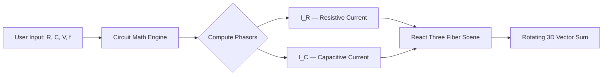

<div align="center">

# ⚡ ParallelRC-3D-Lab

[](https://git.io/typing-svg)


**A browser-based virtual laboratory for exploring how resistors and capacitors behave — together — in parallel.**
See the phase shift. Watch the currents sum. Feel the physics.

[](https://react.dev/)
[](https://threejs.org/)
[](https://docs.pmnd.rs/react-three-fiber)
[](https://vitejs.dev/)
[](LICENSE)


</div>

---

### 🔊 What is this?

> Real circuits don't behave like the flat diagrams in a textbook — current and voltage twist out of phase, magnitudes rotate, and the math (phasors, impedance, vector sums) can feel abstract until you can *see* it move.

**ParallelRC-3D-Lab** renders a parallel **RC circuit** as a live, rotating **3D phasor scene**, letting you manipulate resistance and capacitance and watch:

- ⚙️ The **resistive current** and **capacitive current** vectors rotate in real time
- 🔺 The **vector sum** (total current) trace itself out as a triangle in 3D space
- 📐 The **phase angle** shift as you tune component values
- 🌊 Impedance and admittance respond instantly to your inputs

No labs, no breadboards, no multimeters — just drag, tune, and watch electricity think.

---

### ✨ Features

<table>
<tr>
<td width="50%">

**🧪 Live 3D Phasor Visualization**
Watch resistive and capacitive current vectors rotate and sum in real time, rendered with Three.js.

**🎛️ Interactive Circuit Controls**
Adjust R, C, frequency and voltage on the fly — the whole scene reacts instantly.

</td>
<td width="50%">

**📊 Phase Relationship Insights**
See exactly how far capacitive current leads resistive current — no more mental math.

**🌐 Runs Entirely in the Browser**
Zero installs, zero backend. Built as a single-file Vite bundle you can open anywhere.

</td>
</tr>
</table>

---

### 🛠️ Tech Stack

<div align="center">

| Layer | Technology |
|---|---|
| ⚛️ **UI / Framework** | React 18 |
| 🎮 **3D Rendering** | Three.js + `@react-three/fiber` |
| 📡 **HTTP** | Axios |
| ⚡ **Build Tool** | Vite 5 (`vite-plugin-singlefile`) |

</div>

---

### 🚀 Getting Started

```bash
# 1. Clone the lab
git clone https://github.com/ankush-dev-eng/ParallelRC-3D-Lab.git
cd ParallelRC-3D-Lab

# 2. Install dependencies
npm install

# 3. Fire it up
npm run dev
```

Then open the local dev URL Vite prints — and start dragging sliders. ⚡

<details>
<summary>📦 Building for production</summary>

```bash
npm run build     # bundles into a single-file distributable
npm run preview   # preview the production build locally
```

</details>

---

### 🖥️ How It Works (Under the Hood)



The circuit math computes instantaneous phasors for resistive and capacitive current, then hands them to a `react-three-fiber` scene that animates the vectors and their triangle sum on every frame.

---

### 🗂️ Project Structure

```
ParallelRC-3D-Lab/
├── src/          # React + Three.js source
├── docs/         # Notes & supporting docs
├── index.html    # App entry point
├── vite.config.js
└── package.json
```

---

### 🤝 Contributing

Pull requests, issue reports, and circuit-nerd feedback are all welcome!

1. 🍴 Fork the repo
2. 🌿 Create your feature branch (`git checkout -b feature/amazing-thing`)
3. 💾 Commit your changes
4. 📤 Push and open a PR

---

### 📄 License

Licensed under the **MIT License** — see [`LICENSE`](LICENSE) for details.

---

<div align="center">

### 💡 If this helped you *see* electricity differently, drop a ⭐!


</div>
